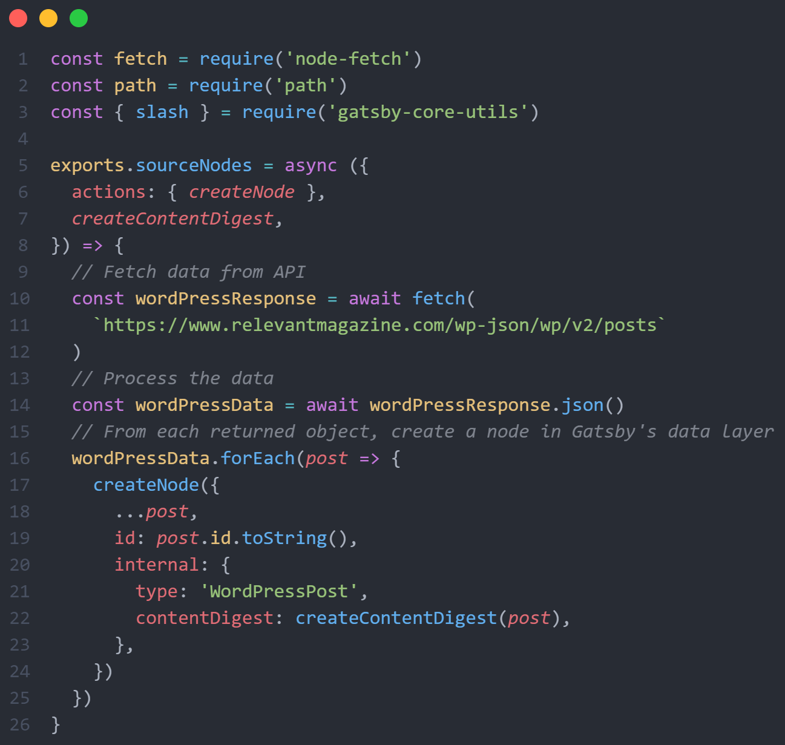
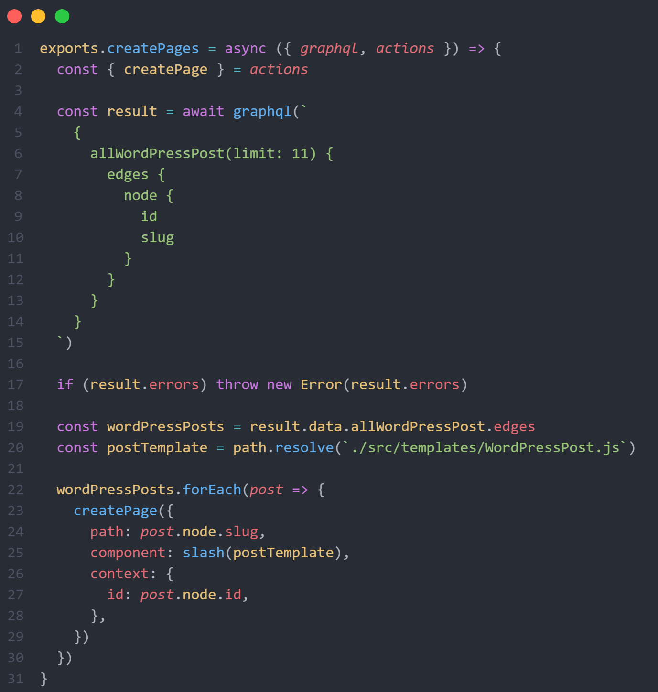
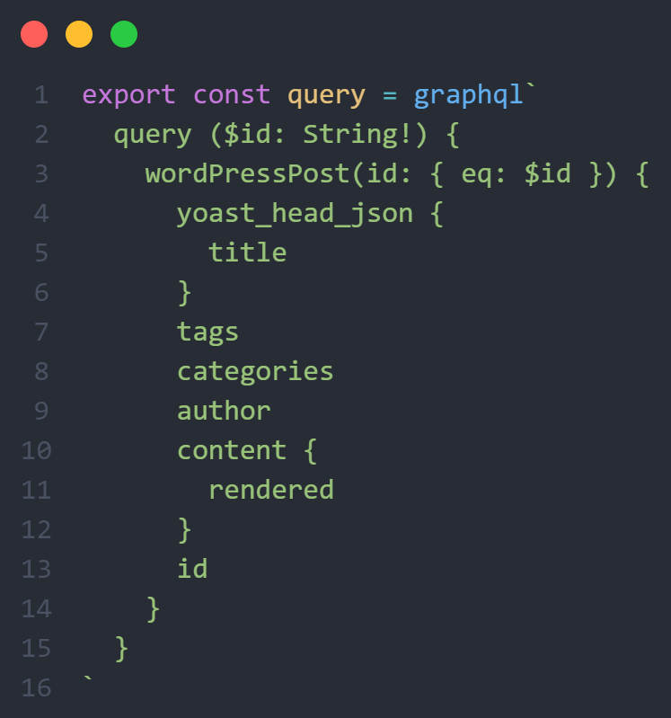
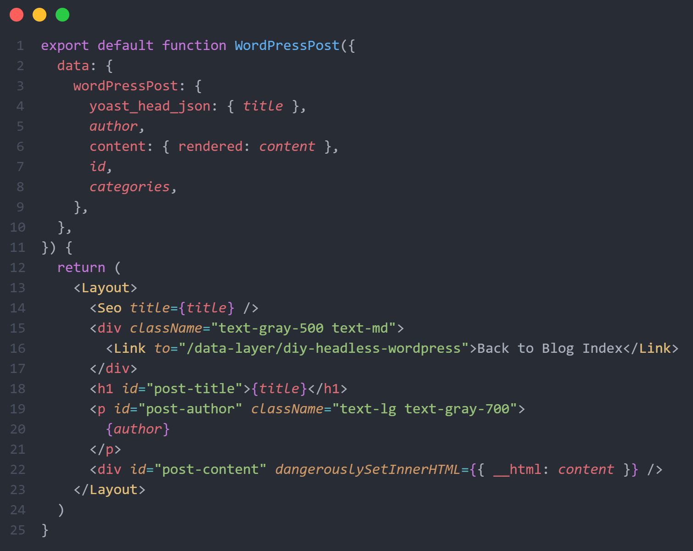
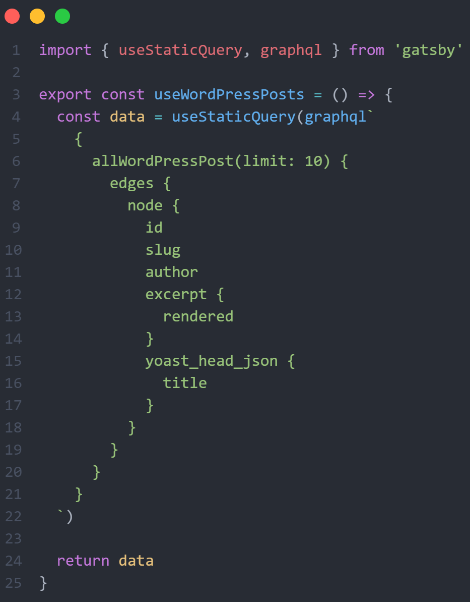
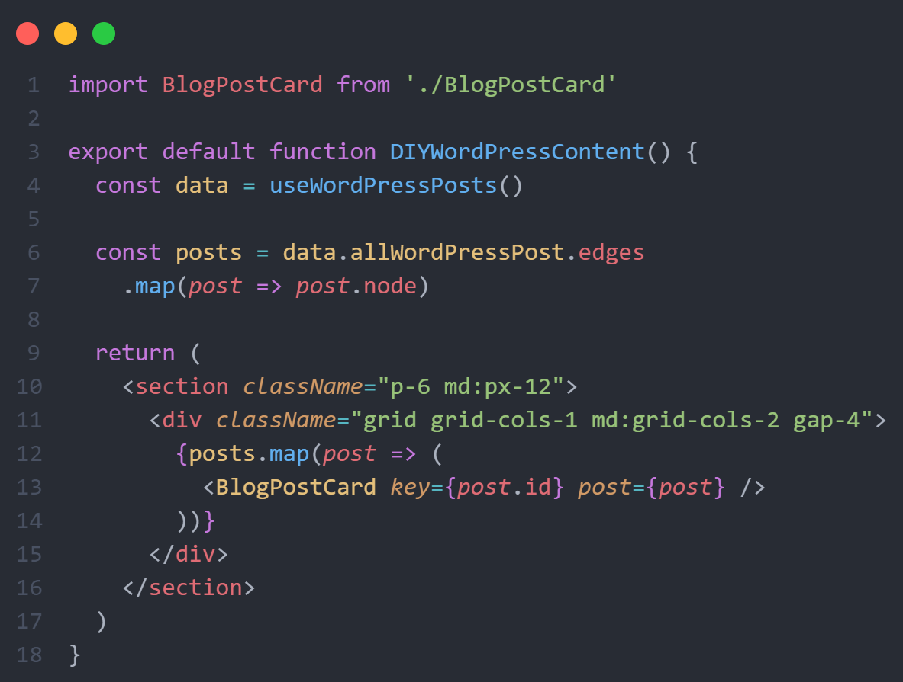
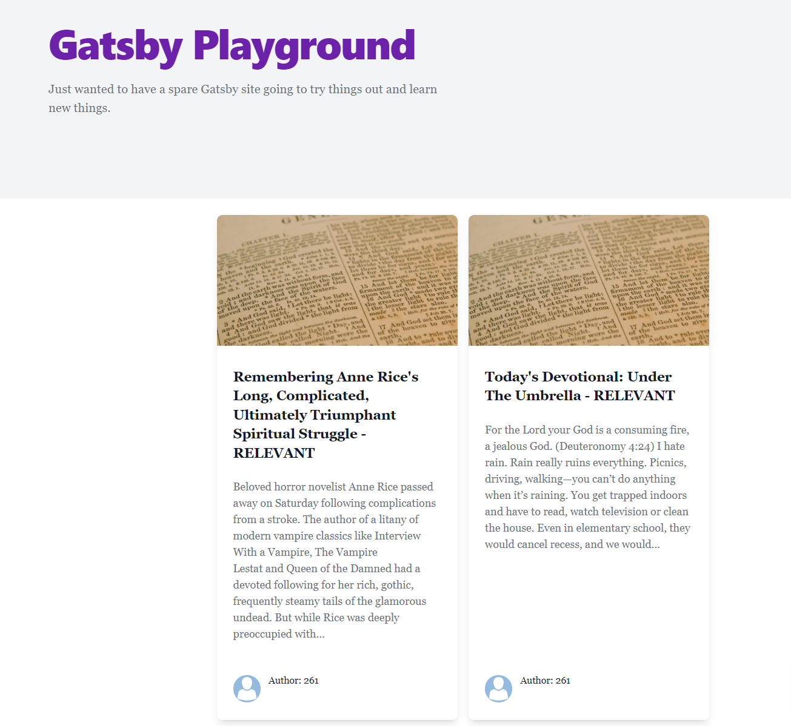

This week, I was excited to see Gatsby publish a new blog post detailing <a class="text-purple-600 hover:text-purple-400" href="https://www.gatsbyjs.com/blog/fetch-data-from-the-new-york-times-api-using-ssg/" rel="noopener noreferrer nofollow" target="_blank">how to fetch data from an external API and add it to Gatsby’s data layer</a>. This means that we can query it with GraphQL in our application, and therefore use it in pages we render at build time with <a class="text-purple-600 hover:text-purple-400" href="https://www.gatsbyjs.com/docs/glossary/static-site-generator/" rel="noopener noreferrer nofollow" target="_blank">Static Site Generation</a>. While this is useful for a number of applications, giving us the tools to create interfaces for nearly any data source, I was curious: could I use this method to build my own data sourcing for Headless WordPress?  

<h2 class="text-gray-700 text-5xl">Headless WordPress & Gatsby</h2> 

Gatsby & Headless WordPress go hand in hand. As the most popular Content Management System (CMS) of all time, WordPress is ubiquitous in the space where marketing and web development meet. Working in digital marketing, I work in WordPress every day, and the excellent integration with the CMS is a big part of why I chose to learn Gatsby in the first place.  

Gatsby already has an official plugin called <a class="text-purple-600 hover:text-purple-400" href="https://www.gatsbyjs.com/plugins/gatsby-source-wordpress/?=wordpress" rel="noopener noreferrer nofollow" target="_blank">gatsby-source-wordpress</a> that makes it easy to connect your frontend to a WordPress installation with minimal configuration, and there are WordPress plugins to make the integration as seamless as possible. However, after reading the article I wanted to see if I could use <a class="text-purple-600 hover:text-purple-400" href="https://www.gatsbyjs.com/contributors/paul-scanlon" rel="noopener noreferrer nofollow" target="_blank">Paul Scanlon’s</a> method to source blog post data from WordPress for myself and use it to programmatically create pages for a site. It turns out that I could, and this is how I did it.  

<h2 class="text-gray-700 text-5xl">Querying the WordPress API</h2> 

There is an official <a class="text-purple-600 hover:text-purple-400" href="https://developer.wordpress.org/rest-api/" rel="noopener noreferrer nofollow" target="_blank">WordPress REST API</a> that has shipped with WordPress for years, creating an endpoint to easily query data from any WordPress site unless the owner has blocked access. A quick search on <a class="text-purple-600 hover:text-purple-400" href="https://builtwith.com/" rel="noopener noreferrer nofollow" target="_blank">BuiltWith</a> can show us which sites are using WordPress, and with WordPress powering over 40% of websites, there are plenty to choose from.  

Most high profile sites that I looked at had blocked public access to their API, but fortunately I found one that did not: an online publication called <a class="text-purple-600 hover:text-purple-400" href="https://www.relevantmagazine.com/" rel="noopener noreferrer nofollow" target="_blank">Relevant Magazine</a> that, according to their homepage meta description, is <blockquote>“The leading platform for Christian twenty- and thirtysomethings, covering the intersection of faith, culture, life and justice like no one else.”</blockquote>  

From the default WordPress API configuration, it’s easy to grab the latest posts from a site by using the endpoint at `${siteURl}/wp-json/wp/v2/posts.`  

<h3 class="text-gray-600 text-4xl">Configuring Gatsby-Node</h3> 

Every Gatsby site comes with a special file in the root directory called gatsby-node.js, where we implement Gatsby’s Node.js APIs. Here we can run server-side code at build time, making it the perfect place to fetch any outside data we might want to use to build static pages.  

<h3 class="text-gray-600 text-4xl">Querying WordPress with Gatsby-Node</h3> 

First we need to query data from the WordPress API, turn it into JSON we can use, and create a node in the data layer for each of them. We can do this using gatsby-node’s createNode action:  

  

Note that, in addition to requiring node-fetch, I am also requiring path, as well as the slash function from gatsby-core-utils for the next step.  

For each object returned from the query, the createNode action is called, which requires four arguments: the object itself (in this case, the WordPress post data), an ID, a type - which will determine the name of the object that we can query with GraphQL - and a content digest, which helps Gatsby determine when to update the data layer.  

<h3 class="text-gray-600 text-4xl">Creating Pages From the Nodes<h3> 

Now that we have our post data, we can use it to create a page for each post. Anyone who has built a Headless WordPress site will be familiar with using the createPages API in gatsby-node to create pages from post data, and the same format works here:  

  

We can directly query the nodes we just added to the data layer. The type we added to the node in the last step is now available to us as an entry point to access the data with GraphQL. With a quick trip to `http:localhost:8000/__graphql`, we can build the query to get precisely what we need.  

For each page that we create, we must pass a path, a component to use to render the data, and a piece of context. The context is used as an identifier so we can query data specific to each page in our template:  

  

Now that we have the data for the individual post, we can pass it into our component and render it where we want it on each page:  

  

With the pages firmly in place, we just need a way to access them. For readability, I like to add post data into a custom hook:  

  

Now we can easily import the posts wherever we need them, such as a blog index page:  

  

So there you have it! We have successfully created our own headless WordPress source that we can query with GraphQL and use throughout our site. View this example in action on my personal <a class="text-purple-600 hover:text-purple-400" href="https://gatsby-playground-site.netlify.app/" rel="noopener noreferrer nofollow" target="_blank">Gatsby Playground</a> site.  

  

