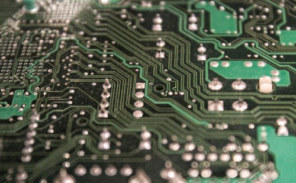

Blockchain is one of the hottest topics in the world of technology and innovation, and many leading experts believe that this will continue to accelerate as more companies and even <a class="text-purple-600 hover:text-purple-400" href="https://www.forbes.com/sites/michaeldelcastillo/2019/12/28/secretary-general-says-united-nations-must-embrace-blockchain/?sh=2723462a1379" rel="noopener noreferrer nofollow" target="_blank">governments</a> adopt this technology. Employers believe that Blockchain is one of the most valuable skills that students entering college can learn, and the demand for Blockchain development is expected to explode over the next two years.  

For many people, Blockchain is a mystery, a word they might have heard thrown around toward the end of 2017 when the price of Bitcoin skyrocketed and introduced the average person to the existence of Cryptocurrency. How are these concepts related, and what do they mean for the future of our technology?  

Blockchain is a way of handling the transmission and storage of data that is decentralized. This means that rather than information being stored on central servers from which users can ask for the data they need (this is what happens when you use Google to search for Baby Yoda memes, for example), the information is stored across many computers (called <a class="text-purple-600 hover:text-purple-400" href="https://bitnodes.io/" rel="noopener noreferrer nofollow" target="_blank">nodes</a>) across the network, ideally around the world. The more nodes a network has, the safer the information becomes, and this also prevents the network from being taken down by external authorities or attacks, because there are no central servers to shut down. The way that this information is stored is in a mechanism called the Blockchain.
  

While historically information storage has been centralized, Blockchain seeks to disrupt the status quo

 
This technology was developed in 2008 as a way to make Bitcoin possible, but Bitcoin was just the beginning. Blockchain itself is capable of handling much more information than just currency transactions, and the way that information is stored is much more secure than centralized systems. In a Blockchain, information can only be stored after it has been approved by the nodes of the network by a mechanism called consensus. In exchange for Cryptocurrency, nodes will use their computing power to confirm that transactions are valid before adding them to the chain. This process is what is known as mining, and it ensures that the network will work properly for all parties involved.  

At its heart, Blockchain operates on the philosophy that all humans will use their resources to act in their own self-interest, and seeks to design a system that ensures that the good of all users is aligned with the best interest of even the most selfish individual. When each node does its part to ensure the integrity of the Blockchain, it creates a system in which information (including Cryptocurrency) is very safe, and once information is added to the Blockchain it is immutable: it can never be changed or removed.  

Why is this technology called “Blockchain”? After the nodes achieve consensus, they store the information in a “block” of data. This block is then added to the existing “chain,” which is comprised of all of the blocks of information that have ever been passed on the chain. Bitcoin’s Blockchain was designed to store monetary transaction information in order to take money and it’s power out of the control of governments and central banks, while Etherium’s Blockchain was designed to run automated applications to remove the need for middle men in many professional settings. These are just two prominent examples of Blockchains that have been created to solve specific needs in the market, but the possibilities are only as limited as human <a class="text-purple-600 hover:text-purple-400" href="https://thenextweb.com/news/nike-blockchain-sneakers-cryptokick-patent" rel="noopener noreferrer nofollow" target="_blank">imagination</a>.  

If anyone can look at the Blockchain, and all information on the chain exists forever, wouldn’t that mean that each user’s information is available for the world to see, negating privacy? Blockchain eliminates this risk through complex cryptography, utilizing algorithms that mask each user’s identity in such a way that it cannot be reverse-engineered to discover the identity of a transactions sender or receiver, ensuring privacy that is unmatched by any other technology or monetary system to this point.  

Please know that this is a simplified explanation of a very complex and multifaceted technology. The purpose of this article is to introduce the curious person to some of the main points about Blockchain so that you have a rudimentary understanding of how it has been used up to this point. If your curiosity leads you to learn more, I recommend starting with some of the articles to which I have linked in this post.  

