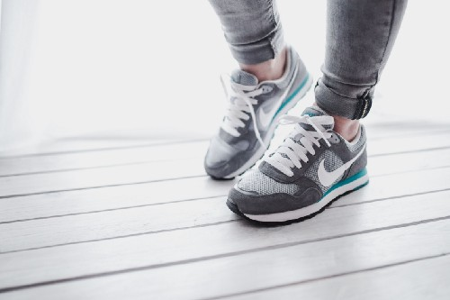
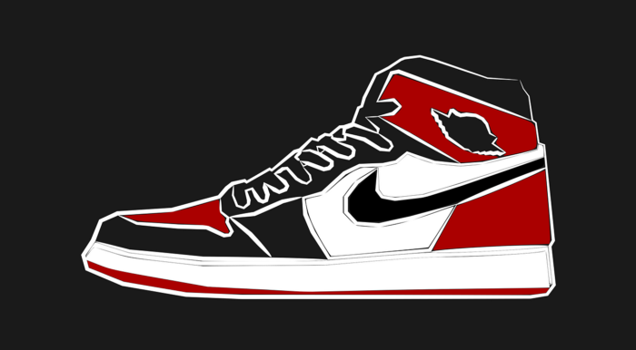

As someone with a passion for both running in my Nike shoes and for blockchain, my proverbial ears certainly perked up when Nike filed for a blockchain patent in 2019. While blockchain has been heralded for its potential to revolutionize industries such as Supply Chain, I was curious about how one of the world’s most recognized brands intended to utilize blockchain as a part of its business-to-consumer strategy.
  

<h3 class="text-gray-600 text-4xl">The Problem of Fake Nikes</h3> 

One of the greatest frustrations for Nike’s customers is the potential for purchasing counterfeit shoes, especially regarding their limited run collections. As sneakerheads and sports fanatics utilize Instagram and TikTok to trade, sell, and show off their freshest kicks, the demand for rare shoes has only increased in recent years, bringing with it a slew of people looking to profit off of the buzz by counterfeiting the company’s most popular sneakers.  

<blockquote class="instagram-media" data-instgrm-captioned data-instgrm-permalink="https://www.instagram.com/p/B7ROTIYgeJf/?utm_source=ig_embed&amp;utm_campaign=loading" data-instgrm-version="13" style=" background:#FFF; border:0; border-radius:3px; box-shadow:0 0 1px 0 rgba(0,0,0,0.5),0 1px 10px 0 rgba(0,0,0,0.15); margin: 1px; max-width:540px; min-width:326px; padding:0; width:99.375%; width:-webkit-calc(100% - 2px); width:calc(100% - 2px);">
 <a href="https://www.instagram.com/p/B7ROTIYgeJf/?utm_source=ig_embed&amp;utm_campaign=loading" style=" background:#FFFFFF; line-height:0; padding:0 0; text-align:center; text-decoration:none; width:100%;" target="_blank"> 
 

 
 

 

 
<svg width="50px" height="50px" viewBox="0 0 60 60" version="1.1" xmlns="https://www.w3.org/2000/svg" xmlns:xlink="https://www.w3.org/1999/xlink"><g stroke="none" stroke-width="1" fill="none" fill-rule="evenodd"><g transform="translate(-511.000000, -20.000000)" fill="#000000"><g><path d="M556.869,30.41 C554.814,30.41 553.148,32.076 553.148,34.131 C553.148,36.186 554.814,37.852 556.869,37.852 C558.924,37.852 560.59,36.186 560.59,34.131 C560.59,32.076 558.924,30.41 556.869,30.41 M541,60.657 C535.114,60.657 530.342,55.887 530.342,50 C530.342,44.114 535.114,39.342 541,39.342 C546.887,39.342 551.658,44.114 551.658,50 C551.658,55.887 546.887,60.657 541,60.657 M541,33.886 C532.1,33.886 524.886,41.1 524.886,50 C524.886,58.899 532.1,66.113 541,66.113 C549.9,66.113 557.115,58.899 557.115,50 C557.115,41.1 549.9,33.886 541,33.886 M565.378,62.101 C565.244,65.022 564.756,66.606 564.346,67.663 C563.803,69.06 563.154,70.057 562.106,71.106 C561.058,72.155 560.06,72.803 558.662,73.347 C557.607,73.757 556.021,74.244 553.102,74.378 C549.944,74.521 548.997,74.552 541,74.552 C533.003,74.552 532.056,74.521 528.898,74.378 C525.979,74.244 524.393,73.757 523.338,73.347 C521.94,72.803 520.942,72.155 519.894,71.106 C518.846,70.057 518.197,69.06 517.654,67.663 C517.244,66.606 516.755,65.022 516.623,62.101 C516.479,58.943 516.448,57.996 516.448,50 C516.448,42.003 516.479,41.056 516.623,37.899 C516.755,34.978 517.244,33.391 517.654,32.338 C518.197,30.938 518.846,29.942 519.894,28.894 C520.942,27.846 521.94,27.196 523.338,26.654 C524.393,26.244 525.979,25.756 528.898,25.623 C532.057,25.479 533.004,25.448 541,25.448 C548.997,25.448 549.943,25.479 553.102,25.623 C556.021,25.756 557.607,26.244 558.662,26.654 C560.06,27.196 561.058,27.846 562.106,28.894 C563.154,29.942 563.803,30.938 564.346,32.338 C564.756,33.391 565.244,34.978 565.378,37.899 C565.522,41.056 565.552,42.003 565.552,50 C565.552,57.996 565.522,58.943 565.378,62.101 M570.82,37.631 C570.674,34.438 570.167,32.258 569.425,30.349 C568.659,28.377 567.633,26.702 565.965,25.035 C564.297,23.368 562.623,22.342 560.652,21.575 C558.743,20.834 556.562,20.326 553.369,20.18 C550.169,20.033 549.148,20 541,20 C532.853,20 531.831,20.033 528.631,20.18 C525.438,20.326 523.257,20.834 521.349,21.575 C519.376,22.342 517.703,23.368 516.035,25.035 C514.368,26.702 513.342,28.377 512.574,30.349 C511.834,32.258 511.326,34.438 511.181,37.631 C511.035,40.831 511,41.851 511,50 C511,58.147 511.035,59.17 511.181,62.369 C511.326,65.562 511.834,67.743 512.574,69.651 C513.342,71.625 514.368,73.296 516.035,74.965 C517.703,76.634 519.376,77.658 521.349,78.425 C523.257,79.167 525.438,79.673 528.631,79.82 C531.831,79.965 532.853,80.001 541,80.001 C549.148,80.001 550.169,79.965 553.369,79.82 C556.562,79.673 558.743,79.167 560.652,78.425 C562.623,77.658 564.297,76.634 565.965,74.965 C567.633,73.296 568.659,71.625 569.425,69.651 C570.167,67.743 570.674,65.562 570.82,62.369 C570.966,59.17 571,58.147 571,50 C571,41.851 570.966,40.831 570.82,37.631"></path></g></g></g></svg>

 
 View this post on Instagram

 

 

 

 

 

 

 

 

 

 
 

 

</a>
<a href="https://www.instagram.com/p/B7ROTIYgeJf/?utm_source=ig_embed&amp;utm_campaign=loading" style=" color:#c9c8cd; font-family:Arial,sans-serif; font-size:14px; font-style:normal; font-weight:normal; line-height:17px; text-decoration:none;" target="_blank">A post shared by Sneaker News (@sneakernews)</a>

</blockquote>

 

Just how big of a problem can fake shoes actually be for Nike? In the past few months alone, <a class="text-purple-600 hover:text-purple-400" href="https://www.cnn.com/2019/10/09/us/counterfeit-nike-shoes-trnd/index.html" rel="noopener noreferrer nofollow" target="_blank">thousands of pairs</a> of fake Nikes have been seized by authorities, amounting to <a class="text-purple-600 hover:text-purple-400" href="https://footwearnews.com/2019/business/legal-news/fake-nike-sneakers-counterfeit-seized-1202854505/" rel="noopener noreferrer nofollow" target="_blank">millions of dollars</a> worth of shoes that could have been stolen from the company by counterfeiters, and these recoveries represent <a class="text-purple-600 hover:text-purple-400" href="https://www.documentcloud.org/documents/6594742-USA-v-Zeng.html" rel="noopener noreferrer nofollow" target="_blank">only a fraction</a> of phony products in circulation. It is a growing problem for Nike, and it must be addressed to maintain the integrity of their brand, as well as other high profile and oft-counterfeited products.  

<h3 class="text-gray-600 text-4xl">Current Solutions Have Proven Insufficient</h3> 

Even <a class="text-purple-600 hover:text-purple-400" href="https://www.nike.com/help/a/nike-product-authenticity" rel="noopener noreferrer nofollow" target="_blank">Nike’s website</a> offers no solution to its customers other than to only purchase products directly from them, either from one of their retail stores or from their website and its accompanying mobile App, but this does not help those who have already purchased expensive counterfeit goods, or those who want to buy a shoe that is no longer available for purchase directly from Nike, such as sold out limited releases and vintage shoes.  
Nike has tried other attempts to address the problem, most notably their failed partnership with Amazon to ensure that customers could purchase genuine Nikes through an established channel, however, the constant battle for Nike to stand out on Amazon next to other sellers — who may or may not be selling authentic shoes — led them to <a class="text-purple-600 hover:text-purple-400" href="https://abcnews.go.com/US/wireStory/nike-calls-off-pilot-program-amazon-ending-direct-66969723" rel="noopener noreferrer nofollow" target="_blank">terminate their deal with Amazon</a> in 2019.  

Nike has been clear that their intention is to <a class="text-purple-600 hover:text-purple-400" href="https://qz.com/1236255/nike-is-expanding-its-direct-to-consumer-digital-business-and-acquired-zodiac-an-analytics-firm/" rel="noopener noreferrer nofollow" target="_blank">build direct relationships</a> with their customer base going forward, driving customers to buy directly from them, and they have been seeking a solution to increase customer confidence and maintain brand integrity while simultaneously gaining greater control over how their products get to their consumers. They also want more insight into exactly what their customers want.  

Cryptography Is Essential to Maintaining a Blockchain's Integrity

 

<h3 class="text-gray-600 text-4xl">How Can Blockchain Solve the Problem?</h3> 

As many industries turn to blockchain for its potential to increase security of information, in this case Nike is aiming to utilize blockchain to increase transparency for consumers. How is this possible?  

While Nike has yet to share the specifics with the public through marketing, they have been granted a <a class="text-purple-600 hover:text-purple-400" href="http://patft.uspto.gov/netacgi/nph-Parser?Sect1=PTO2&Sect2=HITOFF&p=1&u=%2Fnetahtml%2FPTO%2Fsearch-bool.html&r=1&f=G&l=50&co1=AND&d=PTXT&s1=Nike&s2=Crypto&OS=Nike+AND+Crypto&RS=Nike+AND+Crypto" rel="noopener noreferrer nofollow" target="_blank">patent</a> for a new product called “CryptoKicks.” Aside from being the coolest name ever to grace a shoe, it appears that they intend to utilize the cryptography aspect of blockchain to generate tokens that will be paired with the physical shoe, and will be transferred to the cryptocurrency wallet of the person who buys the physical shoe. According to the patent:  

“By way of example, and not limitation, there are presented cryptographic digital assets that are provisioned through a blockchain ledger of transaction blocks and function, in part, to connect a real-world product, such as a physical shoe, to a virtual collectible, such as a digital shoe. When a consumer buys a genuine pair of shoes — colloquially known as “kicks” — a digital representation of a shoe may be generated, linked with the consumer, and assigned a cryptographic token, where the digital shoe and cryptographic token collectively represent a “CryptoKick”. The digital representation may include a computer-generated avatar of the shoe or a limited-edition artist rendition of the shoe. The digital asset may be secured by an encryption-protected block that contains a hash pointer as a link to a related block in a decentralized blockchain, a transaction timestamp, and transaction data.”
 

This function will take advantage of the <a class="text-purple-600 hover:text-purple-400" href="https://medium.com/@andrewkepson/a-threeminute-guide-to-understanding-blockchain-b6e8929dec46" rel="noopener noreferrer nofollow" target="_blank">immutability of data</a> that is made possible through blockchain technology to ensure that the cryptographic tokens, which will be paired with the physical shoes (or other clothing items), are stored on the blockchain’s ledger and can be transferred to the buyer of the shoes. Each owner will have the tokens as proof that their shoes are genuine.  

This aspect alone could be revolutionary for Nike, and if they are successful in convincing the public of its value, it is likely that many more brands will follow suit.  

<h3 class="text-gray-600 text-4xl">“Breeding” Shoes</h3> 

However, for me token verification is not the most interesting aspect of Nike’s plans. The patent goes on to include the following:  

<blockquote>Using the digital asset, the buyer is enabled to securely trade or sell the tangible pair of shoes, trade or sell the digital shoe, store the digital shoe in a cryptocurrency wallet or other digital blockchain locker, intermingle or “breed” the digital shoe with another digital shoe to create “shoe offspring,” and, based on rules of acceptable shoe manufacturability, have the newly bred shoe offspring custom made as a new, tangible pair of shoes.</blockquote> 

 

It seems that Nike is paving the way for users to create their own shoes by actually “breeding” pairs together, perhaps by combining their favorite elements or colors of one model with those of another (within preset constraints). The shoes can then be made by Nike and sent to the creator. It is unclear exactly what this process will look like, and how it will differ from their current <a class="text-purple-600 hover:text-purple-400" href="https://www.nike.com/nike-by-you" rel="noopener noreferrer nofollow" target="_blank">Nike By You</a> offering, but it is an interesting concept indeed, and it will be exciting to see how they implement this strategy.  

It almost seems as if they view their shoes as living things, and they want to reward their customers for using “CryptoKicks” for their intended activity (such as running):  

<blockquote>In some embodiments, a digital asset may include genotype information and/or phenotype information for a digital shoe….virtual user interactions that alter (e.g., speed up or slow down) maturity or increase/decrease a likelihood of certain traits developing; real-world interactions of a user (e.g., running increases number of good/desirable qualities, increases speed of maturity of virtual offspring, etc.); shoe cloning and allowing an owner to set a total number of clones that can be produced from a desirable offspring for actual real-world production. Some optional features may also include: surrogacy features for breeding plans between two or more discrete digital shoes; parenting/nannying features provided by a third-party entity that does not own the digital shoe; behavioral and animated features designed to make a digital shoe appear more life-like (e.g., personalities that change over time); “breeding rights” for a digital shoe may be governed by one or more real-world manufacturing restrictions; ownership rights for each successive generation of a digital shoe may be tied back to the original, real-world shoe (e.g., wholly or partially; by percentage of genotypic contribution, etc.) via encryption key to the originally associated virtual <strong>product.</strong></blockquote> 

 

It is clear that Nike is attempting to usher in a new era for clothing, in which users interact with and take ownership of their footwear in ways that would not have been conceivable only a short time ago. This patent describes an reality in which the physical and virtual come together to create a unique experience for each user, perhaps even rewarding them for reaching fitness goals and introducing <a class="text-purple-600 hover:text-purple-400" href="https://www.growthengineering.co.uk/definition-of-gamification/" rel="noopener noreferrer nofollow" target="_blank">gamification</a> into our fitness routines. Will our shoes start telling us how to improve our form, or better control our heart rate? Only time will tell.  

<h3 class="text-gray-600 text-4xl">Will Consumers Adopt “CyptoKicks”?</h3> 

In addition to working to solve the problem of counterfeiting and establishing direct sales avenues with their customers, Nike is working to change the way we interact with the clothing that we wear. I imagine that their aim is to deepen the relationship that customers have with their brand in ways that have never before been possible, securing their success for a new generation.  

Utilizing blockchain in this way is an interesting application, but will users adopt this technology? Will they care? Certainly the aspect of using tokens to authenticate shoes will be a popular step and will be embraced by collectors and die hard fans of the brand, and Nike will use its vast network of relationships with celebrities and fashion influencers to bring “CryptoKicks” to the public view in full force when the time comes.  

Personally, I find this to be an exciting and innovative approach, and I look forward to seeing Nike implement this product and strategy with great anticipation. When a brand such as Nike starts making moves to bring blockchain to the public, it signals to the rest of the world that blockchain will begin solving not just abstract economic problems but also those that are relevant to our hobbies and daily interactions.

